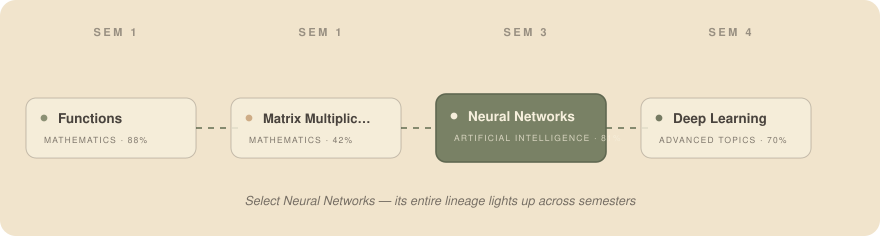
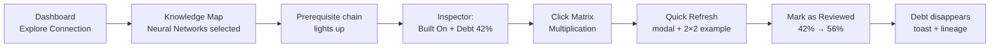
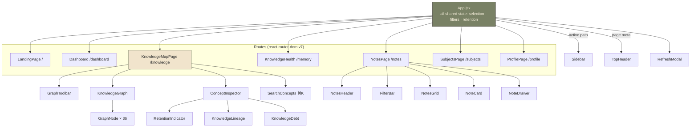
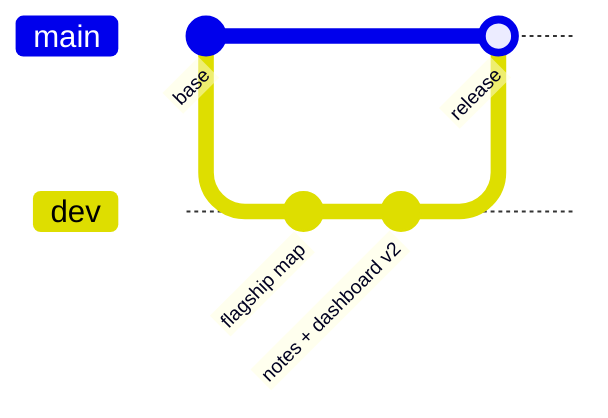

<div align="center">



# Retain360

**ACADEMIC KNOWLEDGE WEB**

*What you learned in 1st year shouldn't disappear by 4th year.*

[](https://react.dev)
[](https://vitejs.dev)
[](https://reactrouter.com)
[](#the-state-model)
[](#the-data-layer)

</div>

---

## Table of Contents

- [The Idea](#the-idea)
- [Quick Start](#quick-start)
- [60-Second Demo Script](#60-second-demo-script)
- [What Makes It Interactive](#what-makes-it-interactive)
- [Architecture](#architecture)
- [The State Model](#the-state-model)
- [The Data Layer](#the-data-layer)
- [Component Reference](#component-reference)
- [Design System](#design-system)
- [Keyboard Shortcuts](#keyboard-shortcuts)
- [Team Workflow](#team-workflow)
- [Viva Prep](#viva-prep-)
- [Roadmap](#roadmap)

---

## The Idea

Universities teach in isolated semester boxes. Retain360 draws the lines between the boxes:

> **Matrices** (Sem 1) → **Matrix Multiplication** (Sem 1) → **Neural Networks** (Sem 3) → **Deep Learning** (Sem 4)
>
> Four concepts. Three semesters. One chain of knowledge.

When you select a concept, Retain360 lights up everything it was *built on* and everything it will be *used in* — and shows you which prerequisites are fading from memory.

---

## Quick Start

```bash
git clone https://github.com/gilldilshaan/Retain360.git
cd Retain360
npm install
npm run dev        # → http://localhost:5173
```

That's it. No `.env`, no database, no API keys — every byte of data lives in [`src/data/`](src/data).

---

## 60-Second Demo Script

This is the exact flow to run in an evaluation. Every step is real state, not a video.



| Step | You do | React does |
|:---:|---|---|
| 0 | Land on the marketing page | scroll-reveals fire via one IntersectionObserver |
| 1 | Click **Launch Map** or **Open App** | `navigate()` into the app shell |
| 2 | On Dashboard, click **Explore Connection →** | `goToConcept()` sets `selectedId` + navigates |
| 3 | Map opens | graph pans to the node via `viewRef.focusOn()` |
| 4 | Watch the graph | unrelated nodes dim, two chains glow |
| 5 | Read inspector | **Built On**: MM · Derivatives · Functions · Probability |
| 6 | Spot **Knowledge Debt** | `retention < 50` → Matrix Multiplication 42% |
| 7 | Click the MM node | inspector swaps via conditional rendering |
| 8 | **Quick Refresh** | modal opens (`refreshId` state) |
| 9 | **Mark as Reviewed** | `retentionOverrides` updates → 56%, debt gone, toast fires |

---

## What Makes It Interactive

| Interaction | Where | Powered by |
|---|---|---|
| Search concepts | press `⌘K` / `Ctrl+K` anywhere on the map | controlled input + `.filter()` |
| Select a node | click / keyboard focus | `selectedId` lifted to App |
| Hover a node | tooltip with subject + retention | `hoveredId` |
| Transitive highlighting | ancestors & descendants light up | `relatedChainIds()` walk |
| **Drag to pan** | grab any empty canvas space | pointer capture + `{ tx, ty }` deltas |
| **Cursor-anchored zoom** | scroll wheel over the map | world-point stays under the cursor (`tx = px − wx·s′`) |
| **Double-click** | empty canvas space | fits the whole map to view |
| Zoom HUD | bottom-right of the map | live `%` readout from `view.s` |
| Semester / Subject filters | toolbar dropdowns | derived `visibleConcepts` |
| Edge toggles | Prerequisites / Related Concepts switches | boolean state + dashed strokes |
| Reset Filters | one click back to defaults | plain setter calls |
| Quick Refresh modal | review a fading concept | Escape key + backdrop close |
| Retention update | Mark as Reviewed | `42% → 56%`, debt auto-clears |
| Cross-page deep links | Dashboard / Notes / Health / Subjects cards | `goToConcept(id)` |
| Scroll reveals | Landing page sections | IntersectionObserver + `.in` class |
| Pin & filter notes | My Notes library | `pinnedIds` array + 4 combobox filters |
| Note drawer | click any paper card | slide-over with tags + related-note jumping |

<details>
<summary><b>Why is the highlight "transitive"?</b></summary>
<br>
Selecting <i>Neural Networks</i> doesn't just highlight direct neighbours.
A tiny breadth-first walk collects <b>every</b> concept reachable by following
<code>prerequisites[]</code> upward and <code>usedIn[]</code> downward — so
Matrices (Sem 1) glows even though it only touches NN through two hops.

```js
// src/data/connections.js — the whole trick, ~15 lines
export function relatedChainIds(id) {
  const seen = new Set([id])
  const queue = [id]
  while (queue.length > 0) {
    const current = conceptsById[queue.pop()]
    for (const p of current.prerequisites || [])
      if (!seen.has(p)) { seen.add(p); queue.push(p) }
    for (const u of current.usedIn || [])
      if (!seen.has(u)) { seen.add(u); queue.push(u) }
  }
  return seen
}
```
</details>

---

## Architecture

One rule: **state that crosses pages lives in `App.jsx`; each page keeps only its tiny local UI state** (e.g. the notes library's search box and pins).



```text
events bubble UP (onSelect, onRefresh, onReviewed…)
props flow DOWN (concept, selected, lookup, handlers…)
```

### The State Model

Every piece of state in the app, in one table. Nothing hidden, nothing duplicated.

| State | Type | Changes when… |
|---|---|---|
| `selectedId` | `string \| null` | a node, chip, lineage step or search result is clicked |
| `hoveredId` | `string \| null` | mouse enters/leaves a node |
| `semesterFilter` | `"all" \| "1"…"4"` | toolbar dropdown changes |
| `subjectFilter` | `"all" \| subject id` | toolbar dropdown or subject card click |
| `showPrerequisites` | `boolean` | toggle switch flips |
| `showRelated` | `boolean` | toggle switch flips |
| `searchOpen` | `boolean` | `⌘K`, header button, or picking a result |
| `refreshId` | `string \| null` | Quick Refresh clicked; cleared on close/review |
| `retentionOverrides` | `{id: number}` | **Mark as Reviewed** (+14, capped at 100) |
| `toast` | `string \| null` | review confirmed; auto-dismisses after 2.6s |

Derived, never stored twice:

```text
concepts          ← static mock data
conceptsLive      ← concepts + retentionOverrides        (useMemo)
visibleConcepts   ← conceptsLive filtered by sem+subject (useMemo)
visibleConnections← edges whose BOTH endpoints are visible
```

### Styling

One stylesheet per surface, imported once in `main.jsx` in cascade order.
Every Notes-library rule is scoped under `.nlib`, so it can never leak into the app shell.

| File | Owns |
|---|---|
| [`global.css`](src/styles/global.css) | design tokens, fonts, resets, focus rings, grain |
| [`shell.css`](src/styles/shell.css) | app frame, sidebar, top header, buttons, modal, toast |
| [`knowledge.css`](src/styles/knowledge.css) | graph toolbar, canvas, nodes, edges, inspector, ⌘K overlay |
| [`dashboard.css`](src/styles/dashboard.css) | dashboard hero, stat cards, focus panel |
| [`memory.css`](src/styles/memory.css) | Knowledge Health page |
| [`subjects.css`](src/styles/subjects.css) | Subjects page |
| [`notes.css`](src/styles/notes.css) | Notes library (teammate UI) |
| [`landing.css`](src/styles/landing.css) | marketing landing page |
| [`profile.css`](src/styles/profile.css) | Profile page + dropdown menu |

---

## The Data Layer

Four small files. Relationships are declared **once** and connections are derived.

```js
// src/data/concepts.js — 36 concepts like this:
{
  id: "matrix-multiplication",
  name: "Matrix Multiplication",
  subject: "mathematics",
  semester: 1,
  retention: 42,            // ← drives status dot, bars, debt warnings
  status: "fading",
  prerequisites: ["matrices"],
  usedIn: ["neural-networks", "cnn", "linear-regression"],
}
```

| File | Exports |
|---|---|
| [`concepts.js`](src/data/concepts.js) | 36 concepts across 4 semesters, fully cross-linked |
| [`connections.js`](src/data/connections.js) | edge builder + transitive `relatedChainIds()` |
| [`positions.js`](src/data/positions.js) | hand-laid x/y coordinates (semester columns) |
| [`subjects.js`](src/data/subjects.js) | subject list + semester labels |
| [`notes.js`](src/data/notes.js) | concept-linked quick notes (inspector + dashboard) |
| [`noteLibrary.js`](src/data/noteLibrary.js) | the 14-note library behind My Notes — tags, related topics, file types |
| [`profile.js`](src/data/profile.js) | the signed-in student: name, initials, degree, semester |

---

## Component Reference

*Every section below expands — click to read.*

<details>
<summary><b>KnowledgeGraph</b> — curved edges, real pan/zoom, node buttons</summary>

- World space: 1320×1050 units inside a transformed <code>&lt;div&gt;</code> (<code>translate + scale</code>)
- <b>Drag to pan</b>: pointer capture on the canvas; a &gt;5px drag suppresses accidental deselection
- <b>Cursor-anchored zoom</b>: non-passive wheel listener (React&rsquo;s is passive) keeps the world
  point under your cursor pinned while the scale changes — clamped 0.22×–2.6×
- Edges are quadratic béziers bowed alternately; highlighted chains get <b>flowing dashes</b>
  that travel prerequisite → concept
- Nodes are real <code>&lt;button&gt;</code>s that cascade in on mount and pulse when selected;
  double-click empty space fits the map, and a mono HUD shows live zoom %
- Exposes <code>zoomIn / zoomOut / fit / reset / focusOn</code> to the toolbar through <code>viewRef</code>
</details>

<details>
<summary><b>NotesPage — the teammate library, integrated</b></summary>

Seven small components under <code>components/notes/</code>: header with recent searches,
a four-way FilterBar (subject · semester · type · pinned), a masonry grid of folded-corner
paper documents in three heights and four colour variants, a sage slide-over drawer with
tags + related-note jumping, an empty state, and file-type icons. All state lives in
<code>NotesPage.jsx</code>; data comes from <code>noteLibrary.js</code> so it can be swapped for an API later.
Every CSS rule is scoped under <code>.nlib</code> and two colliding class names were renamed
<code>nl-*</code> so nothing leaks into — or out of — the app shell.
</details>

<details>
<summary><b>ConceptInspector</b> — the intelligent side panel</summary>

Empty state (constellation illustration) until something is selected. Then:
header → <code>RetentionIndicator</code> → Built On chips → Used Later In chips →
<code>KnowledgeLineage</code> → <code>KnowledgeDebt</code> → notes list → description → footer action.
Every chip and lineage row is a button that re-selects that concept.
</details>

<details>
<summary><b>KnowledgeLineage</b> — the signature element</summary>

Walks up to 3 prerequisites and up to 3 dependents, then renders them as one vertical
chain grouped under <code>SEM n</code> labels. Caption counts concepts vs semesters spanned —
the whole product thesis in four lines of UI.
</details>

<details>
<summary><b>RefreshModal</b> — state change you can see</summary>

Opens for any concept. Shows a worked 2×2 matrix example for Matrix Multiplication.
<b>Mark as Reviewed</b> bumps retention +14 → the parent recomputes <code>conceptsLive</code>
→ the debt card vanishes → toast confirms → a Recent Activity entry appears on the Dashboard.
</details>

<details>
<summary><b>LandingPage</b> — the premium front door</summary>

Floating pill nav, editorial hero with the animated chain graphic, a stats band computed
from mock data, an asymmetric bento of product features, a 3-step workflow, and a sage
thesis band. Scroll-reveals run on one small IntersectionObserver that adds <code>.in</code>
to <code>[data-reveal]</code> elements — the CSS handles the rest. Renders standalone at
<code>/</code>, outside the app frame.
</details>

<details>
<summary><b>The other pages</b></summary>

- <b>Dashboard</b> — greeting hero with live Knowledge Health meter, 4 stat cards, a
  <i>Today&rsquo;s Focus</i> document (semester + recommended revision side by side),
  Needs Revision, Recent Notes, activity + notifications
- <b>Knowledge Health</b> — average retention, strong/steady/fading counts, fading list with bars
- <b>Subjects</b> — per-subject cards with counts; clicking opens the map pre-filtered
- <b>Profile</b> — signed-in student (from <code>profile.js</code>), per-subject strength rows
</details>

---

## Design System

Warm parchment, sage ink, charcoal type. No blues, no gradients, no neon.

| Swatch | Hex | Role |
|---|---|---|
| ▉ | `#F1E4CC` | page background, canvas, paper surfaces |
| ▉ | `#798165` | accents, selected states, edges, buttons |
| ▉ | `#2C2725` | headings, body text, borders, icons |

Typography pairs **DM Serif Display** (editorial headings) with **IBM Plex Sans** (UI)
and **IBM Plex Mono** (metadata, labels, numbers). Cards read as paper documents —
thick borders, folded top-right corner, a slight lift-and-tilt on hover.
Micro-labels are mono uppercase with wide letter-spacing.

---

## Keyboard Shortcuts

| Keys / Mouse | Action |
|---|---|
| `⌘K` / `Ctrl+K` | toggle concept search (map page) |
| `Tab` | move through nodes, chips and controls |
| `Enter` / `Space` | activate the focused node or chip |
| `Esc` | close search panel, drawer or refresh modal |
| `Scroll` on map | zoom anchored under the cursor |
| `Drag` on map canvas | pan the whole web |
| `Double-click` on map | fit everything to view |

---

## Team Workflow



```bash
git checkout dev                     # always branch from dev
git checkout -b yourname/feature     # e.g. riya/memory-page
# …build…
git push -u origin yourname/feature  # then open a PR into dev
```

`main` holds the stable demo build. Features merge `feature → dev`, releases merge `dev → main`.

---

## Viva Prep 

<details>
<summary><b>Q: Where does state live and why?</b></summary>
Anything shared — selection, filters, retention overrides, toasts — lives in <code>App.jsx</code>
because five components need it. Pages keep only local UI state (the notes library owns its
search box, pins and drawer; the landing owns nothing). Rule of thumb: <i>lift it when two
components need it</i>.
</details>

<details>
<summary><b>Q: How does the Dashboard reach a specific node on another route?</b></summary>
<code>goToConcept(id)</code>: sets <code>selectedId</code>, calls <code>navigate("/knowledge")</code>,
then <code>viewRef.current.focusOn(id)</code> pans the graph so the node is centred.
State survives navigation because it belongs to App, not to either page.
</details>

<details>
<summary><b>Q: Why is there one stylesheet per page?</b></summary>
The old single <code>app.css</code> grew past 2,500 lines. It was split by surface into nine files
(<code>shell / knowledge / dashboard / memory / subjects / notes / landing / profile</code>) imported
<b>once in <code>main.jsx</code></b>, in cascade order — so tokens always load first and no page can
accidentally restyle another. Same rules, same order, smaller bundles.
</details>

<details>
<summary><b>Q: The Notes UI came from a teammate. How was it merged without breaking anything?</b></summary>
Only the Notes pieces were taken — never their <code>App.jsx</code>. Their stylesheet lives in
<code>notes.css</code> with every rule scoped under <code>.nlib</code>, two colliding class names were
renamed to <code>nl-*</code>, fonts were remapped to our tokens, and their state logic moved
verbatim into <code>NotesPage.jsx</code> reading from <code>noteLibrary.js</code>. Retain360 stayed the source of truth.
</details>

<details>
<summary><b>Q: Show me filter(), map() and find() earning their keep.</b></summary>
<code>filter()</code> — visibleConcepts, notes results, needsAttention.<br/>
<code>map()</code> — every node, edge, chip, note, activity row you can see.<br/>
<code>find()</code> — hoveredConcept lookup, continueConcept, first weak prerequisite in findDebt.
</details>

<details>
<summary><b>Q: Where is useEffect genuinely needed?</b></summary>
Three places: the ⌘K global listener, the toast auto-dismiss timer,
and Escape-key handling in the modal — all with proper cleanup functions.
</details>

<details>
<summary><b>Q: Why a ref for zoom instead of state?</b></summary>
Toolbar and graph are siblings. The transform is the graph's private concern, so the
graph owns it and publishes methods (<code>fit()</code>, <code>focusOn()</code>) through a shared
<code>viewRef</code>. Sibling communication without lifting transform math into App.
</details>

<details>
<summary><b>Q: What happens on Mark as Reviewed — trace it.</b></summary>
<code>handleReviewed</code> writes <code>{matrix-multiplication: 56}</code> into
<code>retentionOverrides</code> → <code>conceptsLive</code> recomputes → inspector bar fills to 56%
→ <code>findDebt()</code> finds nothing under 50% → debt card unmounts → toast sets and
self-clears → Dashboard activity list grows. Six re-renders from one setState call.
</details>

---

## Roadmap

- [x] Interactive knowledge graph with semester bands
- [x] Concept inspector with lineage + debt detection
- [x] Quick Refresh loop with visible state change
- [x] Router + Dashboard + Notes + Health + Subjects + Profile
- [x] Premium SaaS landing page with scroll reveals
- [x] Teammate Notes library integrated (masonry documents, drawer, pins)
- [x] Graph rebuilt: drag-pan, cursor zoom, flowing edges, HUD
- [x] Per-page stylesheets (9 files, cascade-ordered)
- [x] Responsive layout (desktop-first)
- [ ] Spaced-repetition scheduling on top of `retentionOverrides`
- [ ] Swap `noteLibrary.js` for a real API without touching components
- [ ] Export map as PNG for study groups

---

<div align="center">

**Built by Team Retain360** · B.Tech CSE (AI & ML) · Frontend Engineering project

*No backend was harmed in the making of this knowledge web.*

</div>
